# Laporan Praktikum Jarkom

## Tujuan Praktikum
Menginstal wireshark dan dan mempelajari sedikit tentang tools pada software wireshark

## Langkah Percobaan 
1. Download ISO Wireshark melalui chrome ataup pun browser
2. Setelah selesai, lakukan instalansi Wireshark
3. Buka Wireshark dan klik wifi (jika menggunakan wifi)
4. Jika ingin mencari bagian protocol tertentu, klik pada bagian display filter bar, lalu masukkan protocol yang ingin dicari
5. Saat wireshark sedang berjalan, jalankan URL http://gaia.cs.umass.edu/wireshark-labs/INTRO-wireshark-file1.html pada halaman chrome atau browser
6. Lalu kembali pada wireshark dan stop capturing packets atau logo berwarna merah
7. setelahnya klik filter bar untuk mencari protokol http. jika tidak muncul ulangi step dari membuka wireshark hingga muncul protocol yang ingin dicari

## Lampiran
Hasil Percobaan:
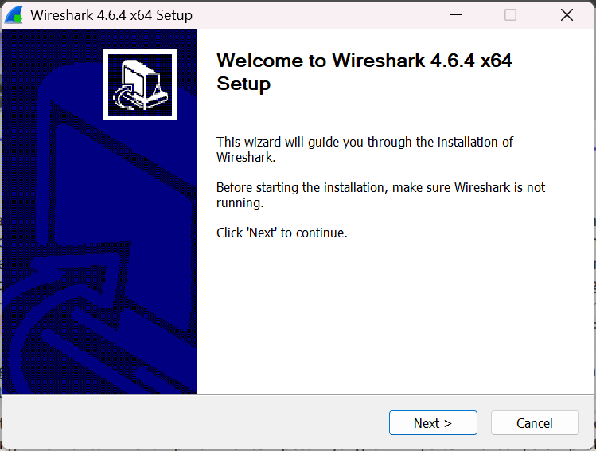
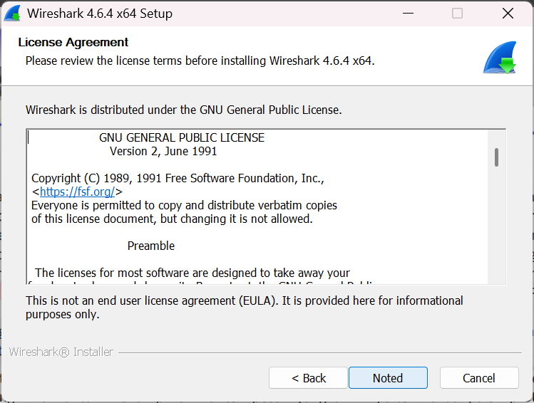
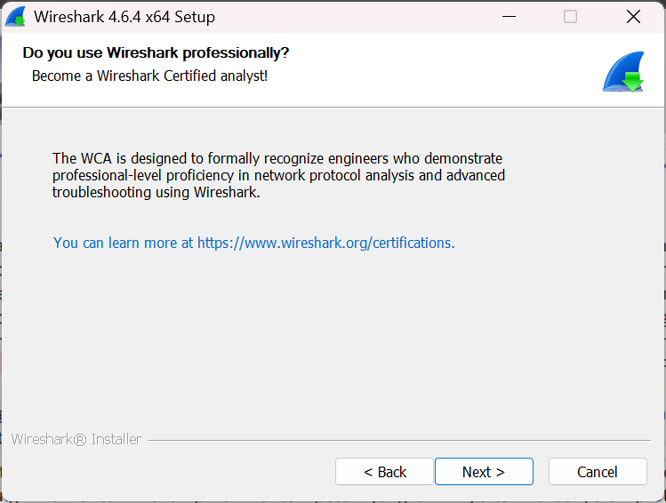
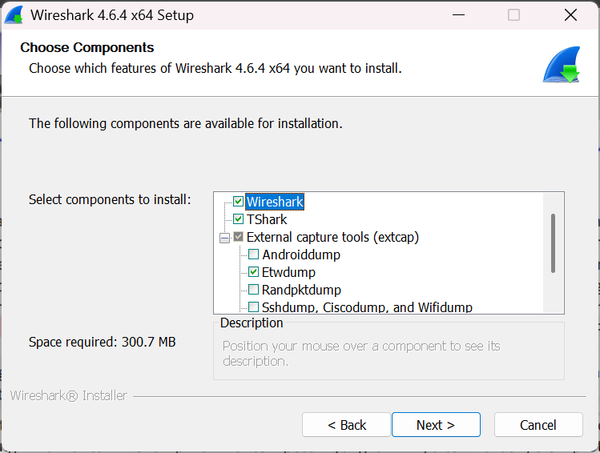
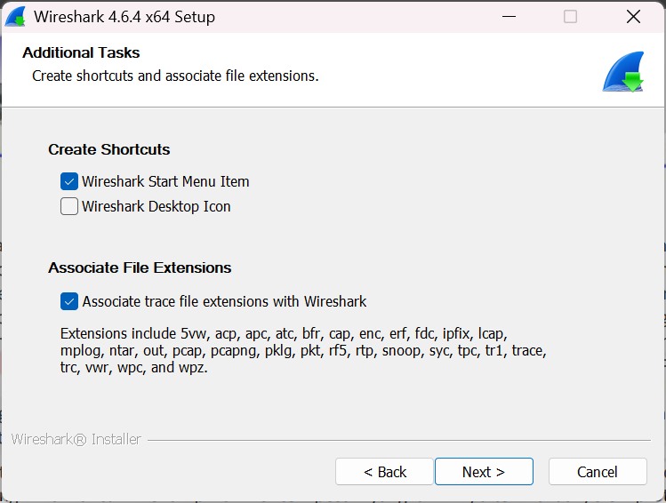
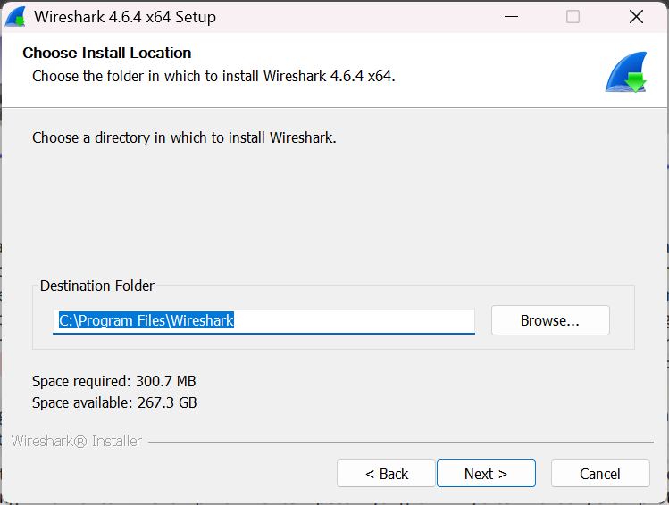
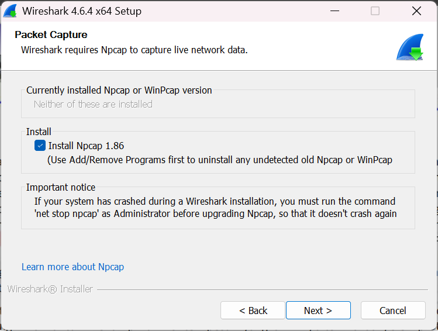
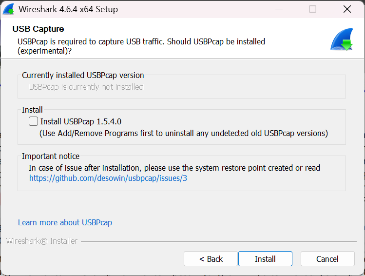
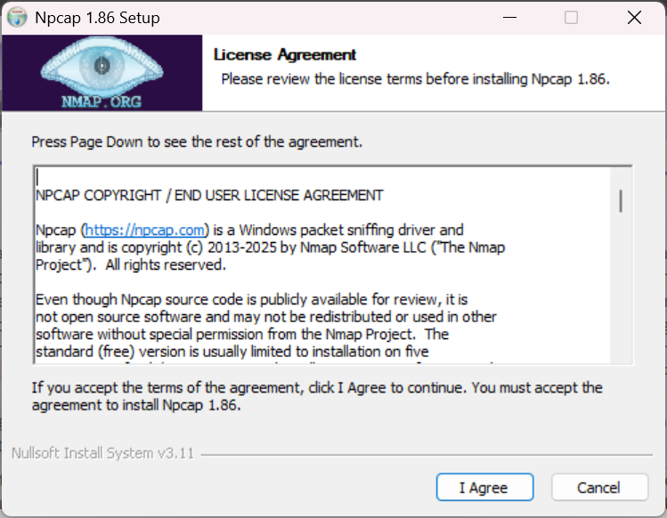
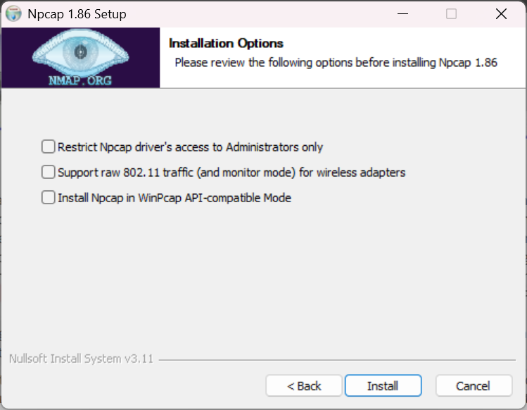
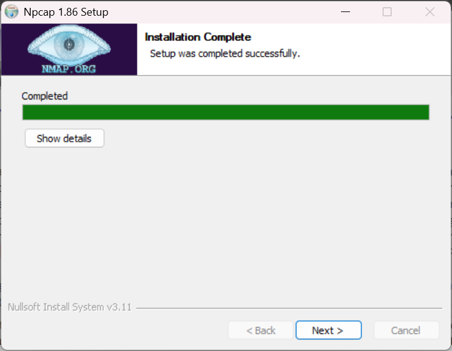
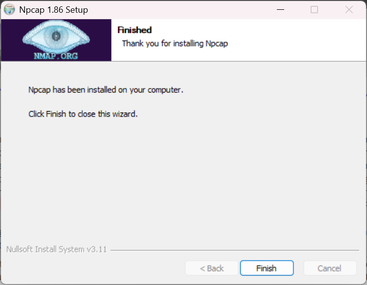
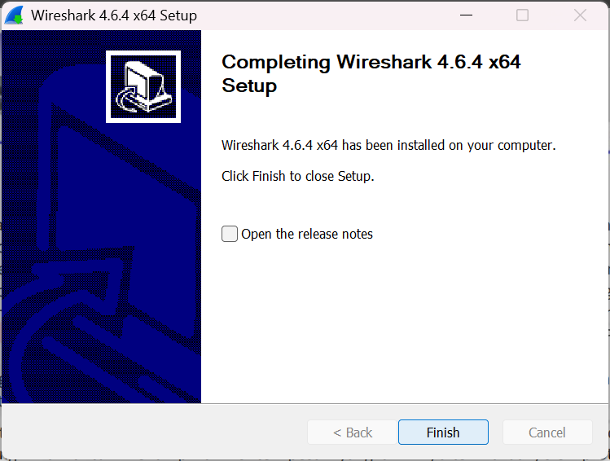
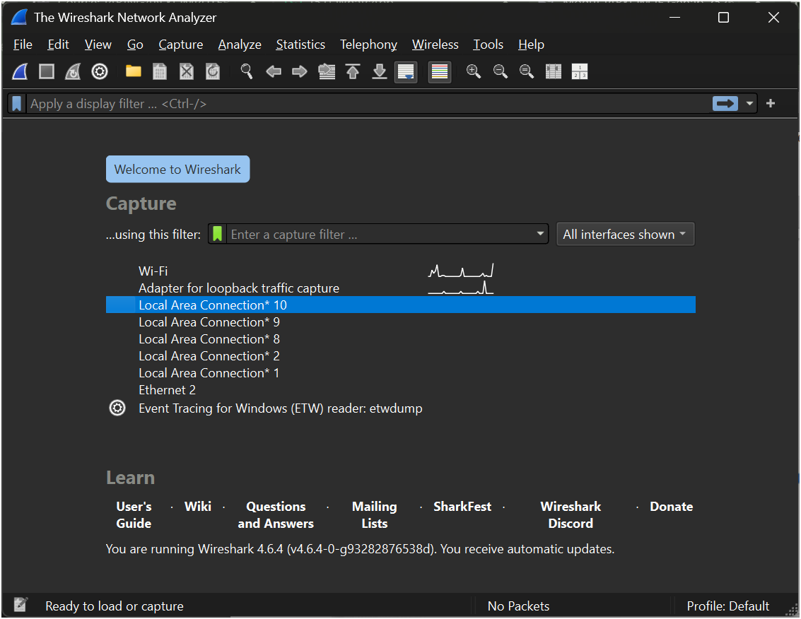
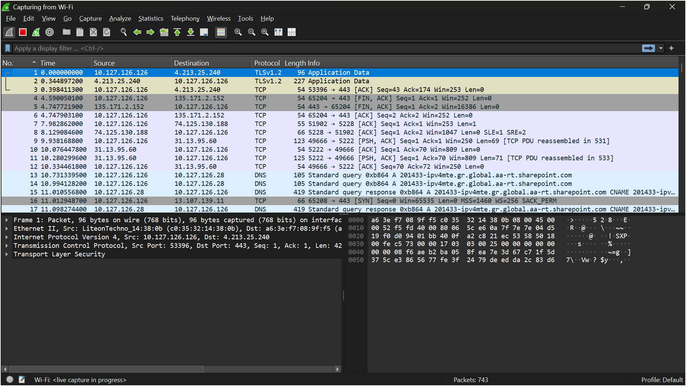

