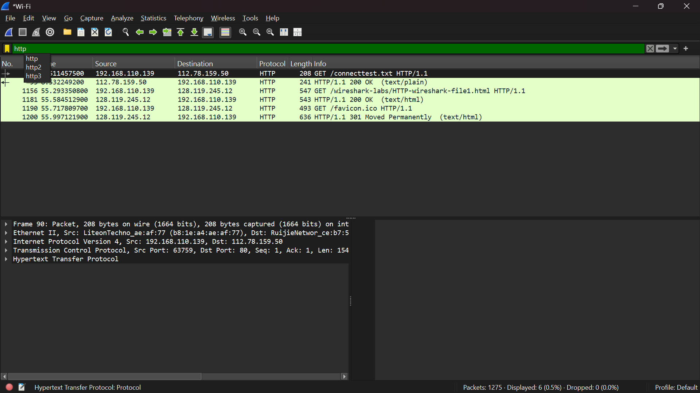
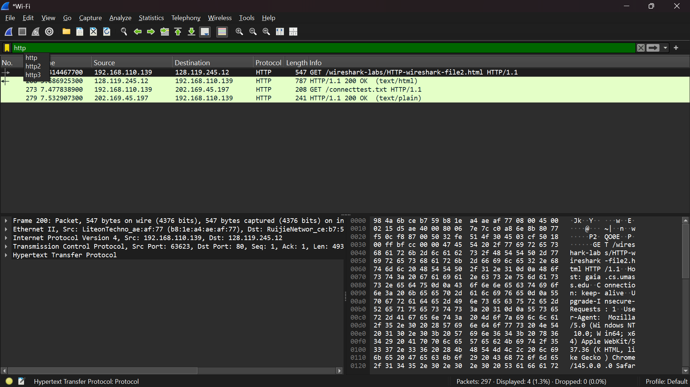
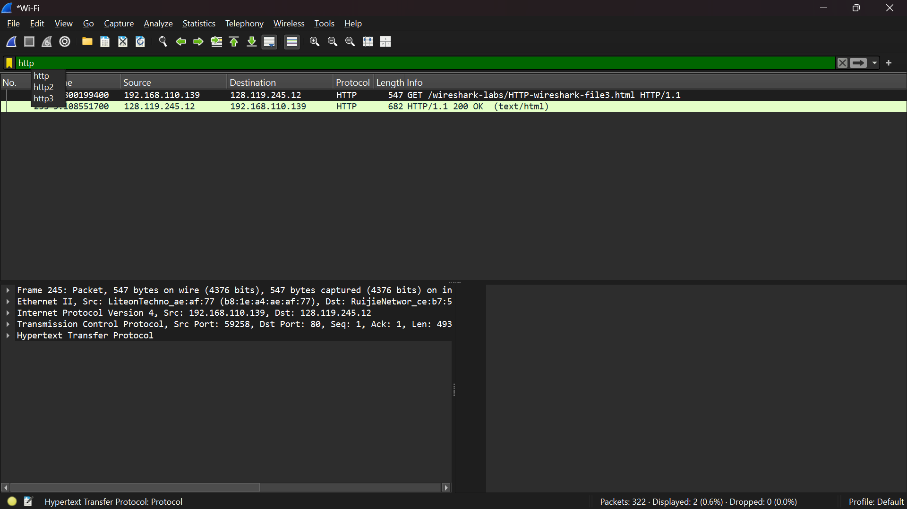
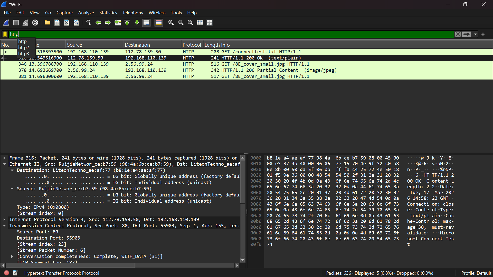
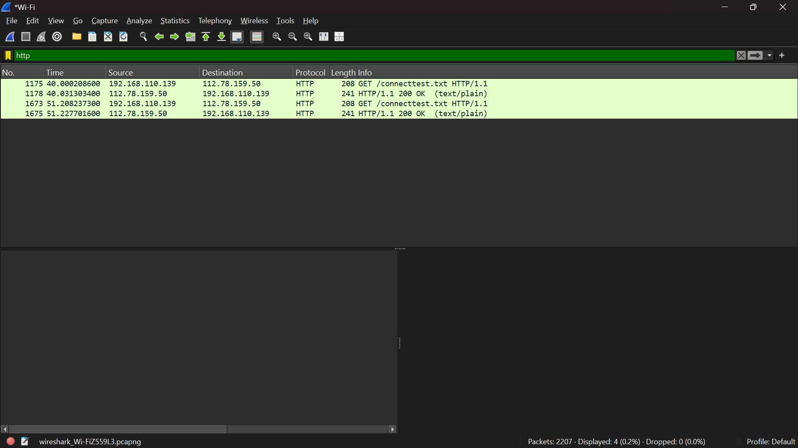

# Laporan Praktikum JARKOM

## Tujuan Praktikum
Mempelajari beberapa aspek protokol HTTP dan dapat menginvestigasi cara kerja protokol HTTP menggunakan Wireshark

## Langkah Percobaan
### Basic HTTP GET/response interaction
1. Buka software wireshark
2. Lalu klik bagian wifi (hanya dengan menggunkan wifi)
3. Selanjutnya, filter bagian protokol http pada bagian display filter bar
4. Tunggu sekitar 2 menit lalu masukkan URL berikut ke browser anda http://gaia.cs.umass.edu/wireshark-labs/HTTP-wireshark-file1.html
5. Hentikan pengambilan paket wireshark

Hasil Percobaan:

### HTTP CONDITIONAL GET/response interaction
1. Jalankan browser web Anda, dan pastikan cache browser Anda dibersihkan (jika belum,
hapus terlebih dahulu cache dan history browser anda)
2. Mulai tangkap paket dengan Wireshark
3. Masukkan URL berikut ke browser Anda http://gaia.cs.umass.edu/wireshark-labs/HTTP-wireshark-file2.html Browser Anda akan menampilkan file HTML lima baris yang sangat sederhana
4. Masukkan kembali URL yang sama ke browser Anda dengan cepat (atau cukup tekan tombol refresh di browser Anda)
5. Hentikan pengambilan paket Wireshark, dan masukkan “http” di jendela spesifikasi filter tampilan, sehingga hanya pesan HTTP yang diambil yang akan ditampilkan nanti di jendela daftar paket

Hasil Percobaan:

### Retrieving Long Documents
1. Jalankan browser web Anda, dan pastikan cache browser Anda dibersihkan (jika belum, hapus terlebih dahulu cache dan history browser anda)
2. Mulai tangkap paket dengan Wireshark
3. Masukkan URL berikut ke browser Anda http://gaia.cs.umass.edu/wireshark-labs/HTTP-wireshark-file3.html Browser Anda seharusnya menampilkan Bill of Rights AS yang agak panjang
4. Hentikan pengambilan paket Wireshark, dan masukkan “http” di jendela tampilan-filterspesifikasi, sehingga hanya pesan HTTP yang diambil yang akan ditampilkan

Hasil Percobaan:

### HTML Documents dengan Embedded Objects
1. Jalankan browser web Anda, dan pastikan cache browser Anda dibersihkan (jika belum,
hapus terlebih dahulu cache dan history browser anda), seperti yang dibahas di atas.
2. Mulai tangkap paket dengan Wireshark.
3. Masukkan URL berikut ke browser Anda http://gaia.cs.umass.edu/wireshark-labs/HTTP-wireshark-file4.html
4. Browser Anda harus menampilkan file HTML pendek dengan dua gambar. Kedua gambar ini
direferensikan dalam file HTML dasar. Artinya, gambar itu sendiri tidak terdapat dalam HTML;
alih-alih hanya terdapat URL kedua gambar pada file HTML tersebut. Browser Anda harus
mengambil logo ini dari URL situs web yang disematkan pada file HTML. Logo penerbit kita
diambil dari situs web gaia.cs.umass.edu.
5. Hentikan pengambilan paket Wireshark, dan masukkan “http” di jendela tampilan-filterspesifikasi, sehingga hanya pesan HTTP yang diambil yang akan ditampilkan.

Hasil Percobaan:

### HTTP Authentication
1. Jalankan browser web Anda, dan pastikan cache browser Anda dibersihkan (jika belum, hapus
terlebih dahulu cache dan history browser anda), seperti yang dibahas di atas.
2. Mulai tangkap paket dengan Wireshark.
3. Masukkan URL berikut ke browser Anda http://gaia.cs.umass.edu/wireshark-labs/protected_pages/HTTP-wireshark-file5.html Ketik username dan password yang diminta
ke dalam kotak pop up (username = wireshark-student, dan password = network).
4. Hentikan pengambilan paket Wireshark, dan masukkan “http” di jendela spesifikasi filter
tampilan, sehingga hanya pesan HTTP yang diambil yang akan ditampilkan nanti di jendela daftar paket.

Hasil Percobaan:
