# Laporan Praktikum Jaringan Komputer
Nama    : Chartika Jenyansa Pangaribuan
NIM     : 103072400026

## Tujuan Praktikum
Mempelajari lebih lanjut cara kerja DNS menggunakan Wireshark dan CMD

## Langkah Percobaan
### Nslookup
Pertanyaan:
1. Jalankan nslookup untuk mendapatkan alamat IP dari server web di Asia. Berapa alamat IP server tersebut?
2. Jalankan nslookup agar dapat mengetahui server DNS otoritatif untuk universitas di Eropa.
3. Jalankan nslookup untuk mencari tahu informasi mengenai server email dari Yahoo! Mail melalui salah satu server yang didapatkan di pertanyaan nomor 2. Apa alamat IP-nya?

Jawaban:
1. Domain yang digunakan adalah www.ui.ac.id dengan Alamat IP (IPv4) adalah 152.118.147.93
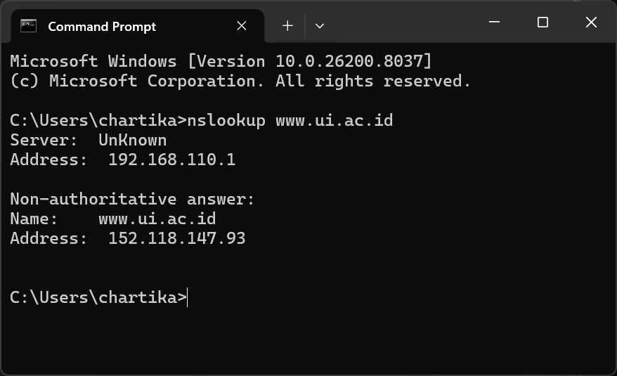
2. Berdasarkan hasil analisis, diperoleh beberapa server DNS otoritatif untuk domain ox.ac.uk, yaitu dns0.ox.ac.uk, dns1.ox.ac.uk, dns2.ox.ac.uk, auth4.dns.ox.ac.uk, auth5.dns.ox.ac.uk, dan auth6.dns.ox.ac.uk. Hasil yang ditampilkan berstatus Non-authoritative answer, yang berarti informasi berasal dari cache DNS lokal, namun tetap valid untuk mengidentifikasi nameserver domain tersebut. Hal ini menunjukkan bahwa domain ox.ac.uk menggunakan beberapa server DNS untuk meningkatkan keandalan dan distribusi beban dalam proses resolusi nama domain.
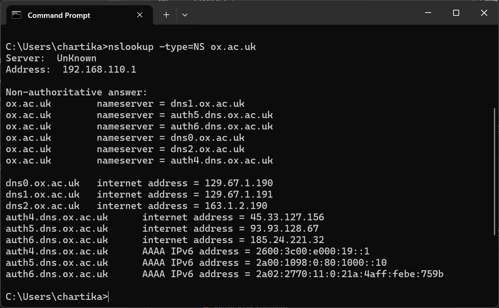
3. Berdasarkan hasil analisis, diperoleh informasi bahwa domain yahoo.com memiliki beberapa mail exchanger yaitu mta6.am0.yahoodns.net, mta7.am0.yahoodns.net, dan mta5.am0.yahoodns.net dengan prioritas yang sama. Meskipun sempat terjadi DNS request timed out, hasil tetap berhasil diperoleh dan berstatus Non-authoritative answer, yang berarti data berasal dari cache DNS, namun tetap valid. Hal ini menunjukkan bahwa Yahoo menggunakan beberapa server email untuk meningkatkan keandalan dan distribusi beban dalam layanan pengiriman email.
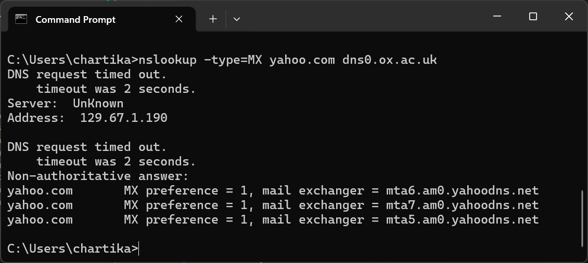

### Ipconfig
1. ketika memberikan perintah ipconfig pada CMD, maka akan menampilkan informasi konfigurasi jaringan pada komputer yang meliputi TCP/IP termasuk alamat IP anda, alamat server DNS dan lainnya.
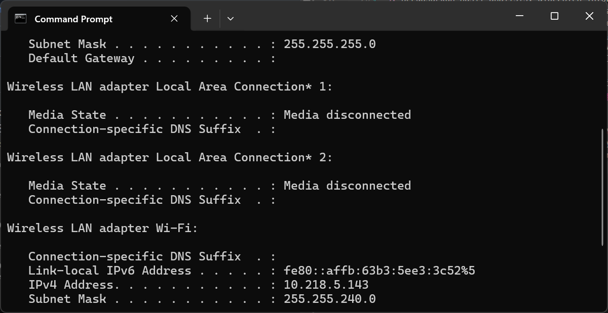
2. untuk perintah ipconfig /all akan memunculkan nama device atau host name dan informasi lengkap mengenai konfigurasi jaringan yang digunakan oleh komputer.
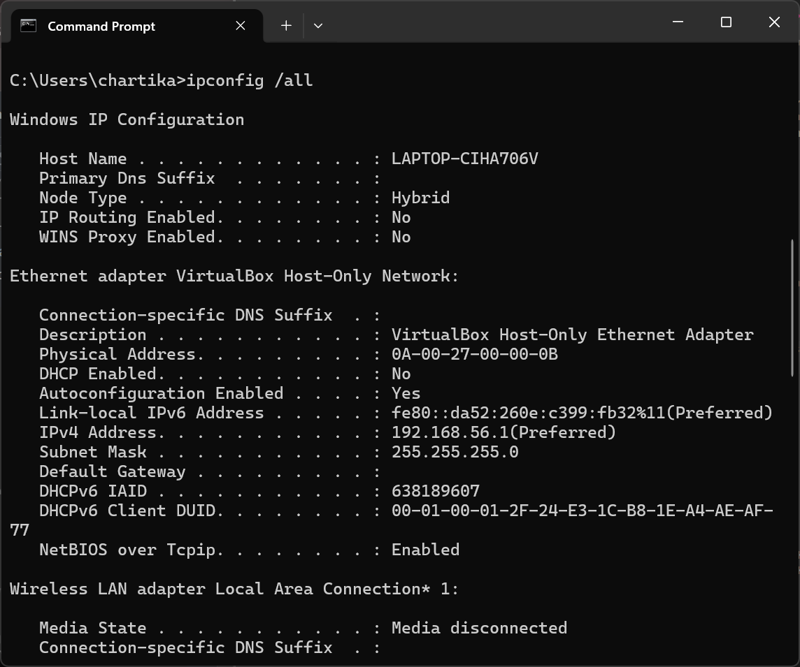
3. ipconfig /displaydns, akan menampilkan informasi DNS yang tersimpan pada komputer, menampilkan record dan sisa Time To Live (TTL).
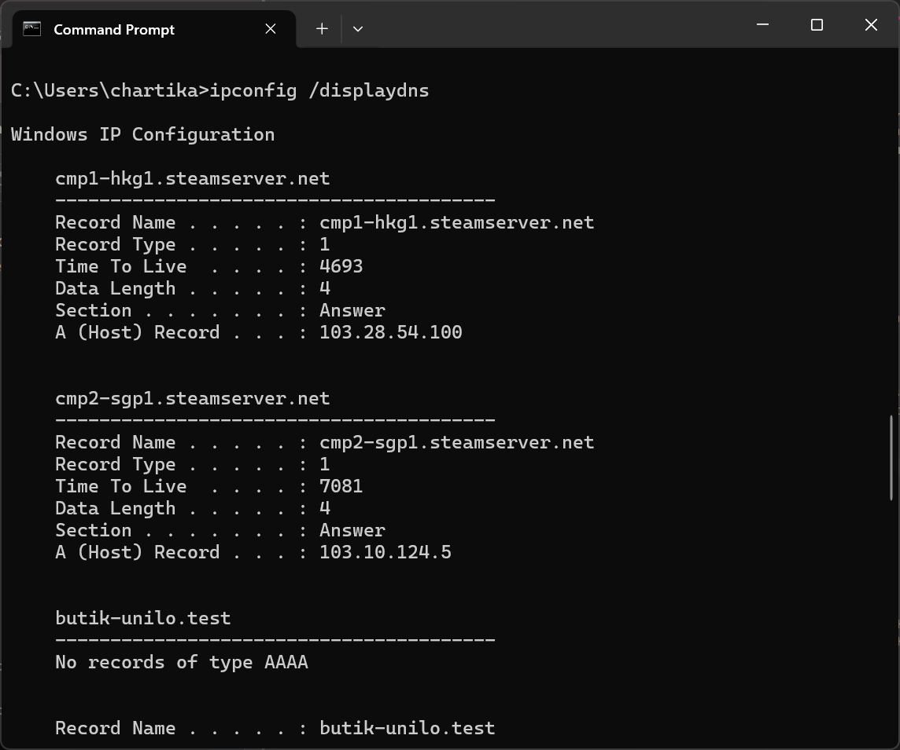
4. ipconfig /flushdns. berfungsi untuk mengosongkan catatan DNS dalam artian akan menghapus seluruh record dan memebuat ulang record dari file.
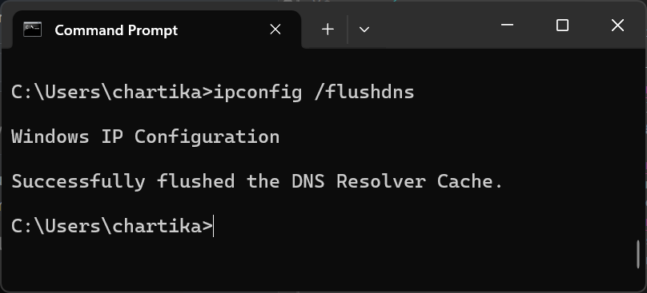

### Tracing DNS dengan Wireshark
#### Percobaan ke-1:
1. Gunakan ipconfig untuk mengosongkan catatan DNS di host
2. Buka browser dan kosongkan cachenya, bisa dengan Ctrl+Shift+Del.
3. Buka wireshark dan masukkan "ip.addr == 10.218.5.143" pada filter
4. Mulai pengambilan paket pada wireshark
5. Buka URL berikut http://www.ietf.org/ pada browser anda
6. Hentikan pengambilan paket

Pertanyaan:
1. Cari pesan permintaan DNS dan balasannya. Apakah pesan tersebut dikirimkan melalui UDP
atau TCP?
- Jawaban: berdasarkan hasil capturing, pesan permintaan dan pesan balasan DNS dikirim menggunakan protokol UDP dengan destination 53, yang merupakan port standart untuk layanan DNS
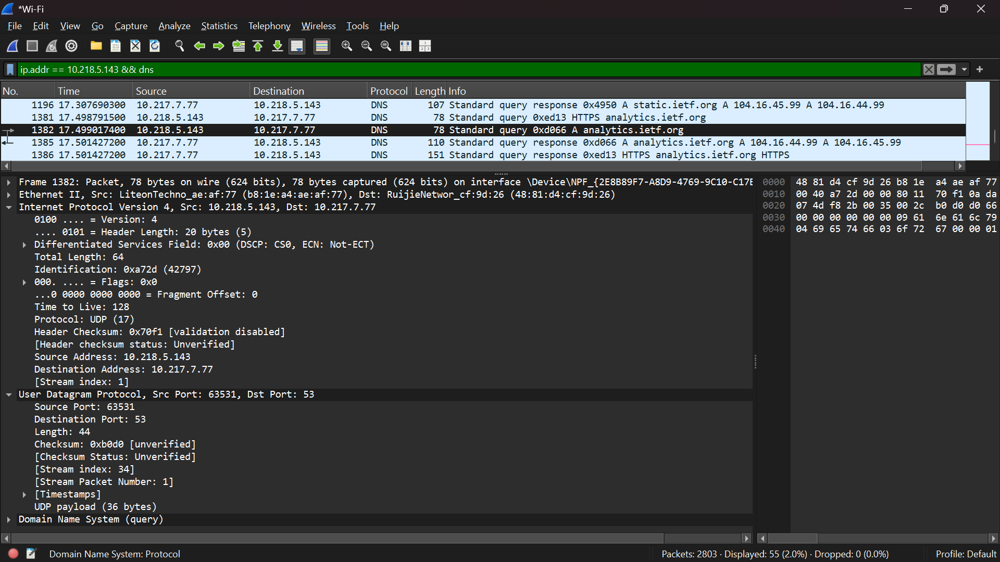
2. Apa port tujuan pada pesan permintaan DNS? Apa port sumber pada pesan balasannya?
- Jawaban: port tujuan pada permintaan DNS adalah 53 sedangkan port sumber pada balasannya adalah 63531

3. Pada permintaan DNS, apa alamat IP tujuannya? Apa alamat IP server DNS lokal anda (gunakan ipconfig untuk mencari tahu)? Apakah kedua alamat IP tersebut sama?
- Jawaban: alamat IP tujuan dan dan alamat IP server DNS lokal sama
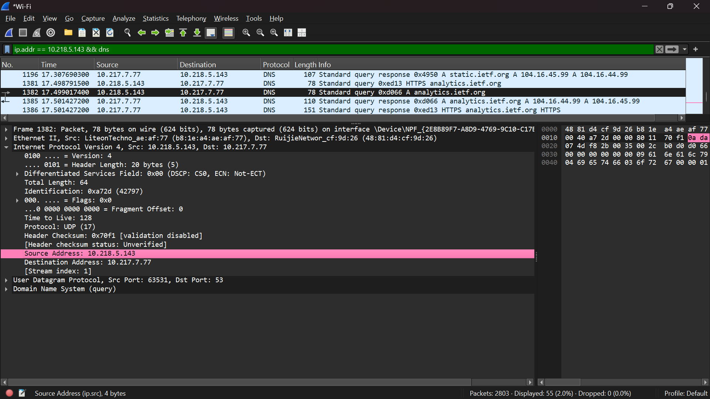
4. Periksa pesan permintaan DNS. Apa “jenis” atau ”type” dari pesan tersebut? Apakah pesan permintaan tersebut mengandung ”jawaban” atau ”answers”?
- Jawaban: pesan permintaan DNS merupakan type A dan pesan permintaan tersebut tidak mengandung jawaban atau answer (answer=0)
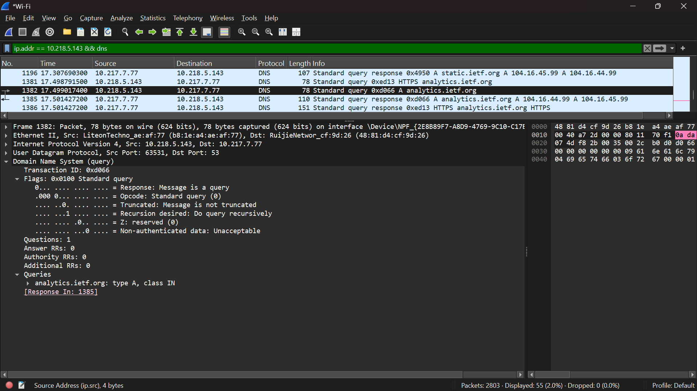
5. Periksa pesan balasan DNS. Berapa banyak ”jawaban” atau ”answers” yang terdapat di dalamnya? Apa saja isi yang terkandung dalam setiap jawaban tersebut?
- Jawaban: answers pada pesan balasan DNS adalah 2. kedua jawaban tersebut berisi alamat IP www.eitf.org yaitu 104.16.44.99 dan 104.16.45.99
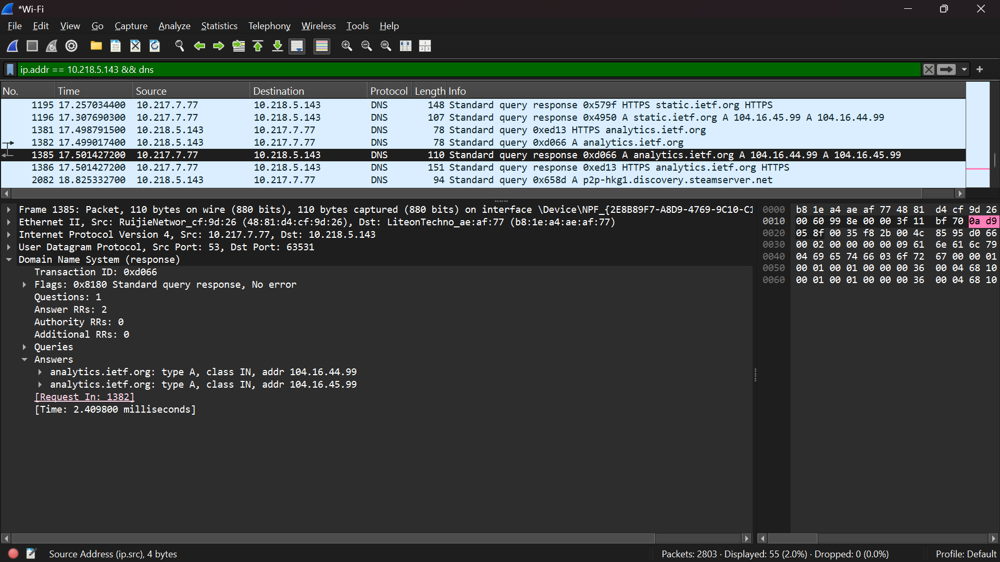
6. Perhatikan paket TCP SYN yang selanjutnya dikirimkan oleh host Anda. Apakah alamat IP pada paket tersebut sesuai dengan alamat IP yang tertera pada pesan balasan DNS?
- Jawaban: setelah menerima balasan DNS, host akan mengirimkan paket TCP SYN untuk memulai koneksi ke server tujuan.
Alamat IP pada paket TCP SYN sesuai dengan alamat IP yang diperoleh dari hasil DNS response, yaitu salah satu dari IP yang telah di-resolve sebelumnya.
7. Halaman web yang sebelumnya anda akses (http://www.ietf.org) memuat beberapa gambar. Apakah host Anda perlu mengirimkan pesan permintaan DNS baru setiap kali ingin mengakses suatu gambar?
- Jawaban: host tidak perlu mengirimkan permintaan DNS baru setiap kali mengakses suatu gambar pada halaman web. Hal ini dikarenakan hasil resolusi DNS disimpan dalam DNS cache. Selama nilai Time To Live (TTL) masih berlaku, host dapat langsung menggunakan alamat IP yang sudah tersimpan tanpa melakukan query ulang ke server DNS.

#### Percobaan ke-2
1. Mulai capture paket pada wireshark
2. Lakukan perintah "nslookup www.mit.edu" pada cmd
3. Stop capturing pake pada wireshark

Pertanyaan:
1. Apa port tujuan pada pesan permintaan DNS? Apa port sumber pada pesan balasan DNS?
- Jawaban: port tujuannya adalah 53 dan sumbernya adalah 61114
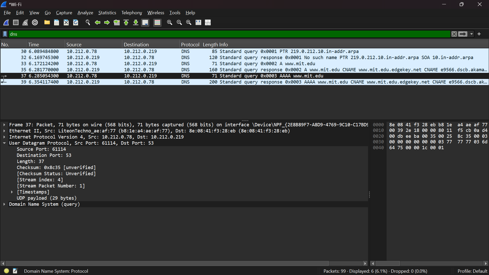
2. Ke alamat IP manakah pesan permintaan DNS dikirimkan? Apakah alamat IP tersebut merupakan default alamat IP server DNS lokal Anda?
- Jawaban: pesan permintaan dns dikirim ke alamat IP 10.212.0.78, alamat IP tersebut bukan alamat default IP server dns lokal
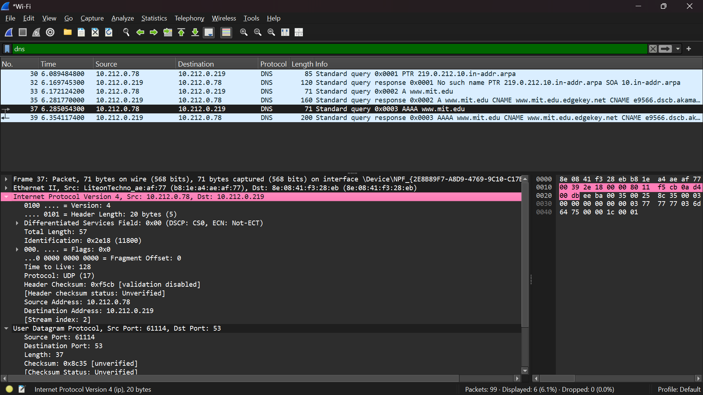
3. Periksa pesan permintaan DNS. Apa ”jenis” atau ”type” dari pesan tersebut? Apakah pesan tersebut mengandung ”jawaban” atau ”answers”?
- Jawaban: type dari pesan dns tersebut adalah AAAA dan tidak mengandung answer
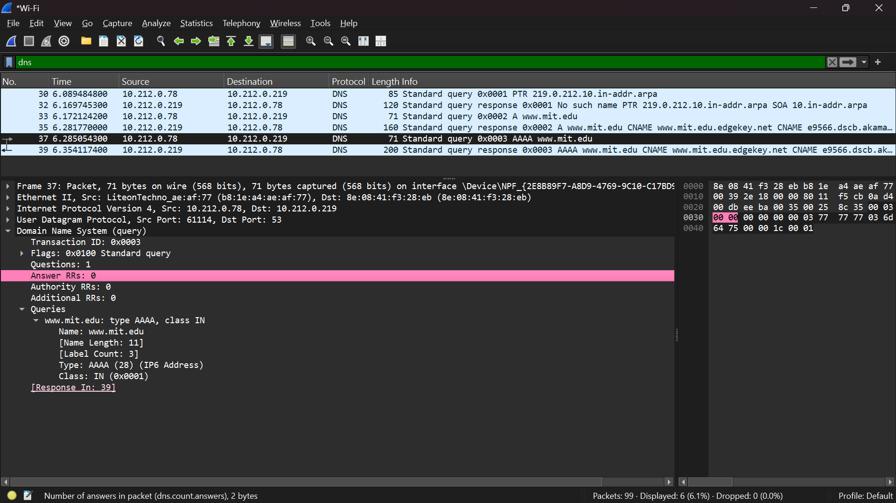
4. Periksa pesan balasan DNS. Berapa banyak ”jawaban” atau “answers” yang terdapat didalamnya. Apa saja isi yang terkandung dalam setiap jawaban tersebut?
- Jawaban: pesan balasan dns memiliki 4 answer
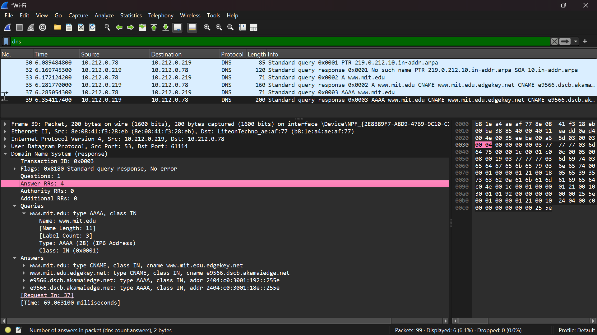

#### Percobaan ke-3
1. Mulai capture paket pada wireshark
2. Lakukan perintah "nslookup -type=NS mit.edu" pada cmd
3. Stop capturing paket pada wireshark

Pertanyaan:
1. Ke alamat IP manakah pesan permintaan DNS dikirimkan? Apakah alamat IP tersebut merupakan default alamat IP server DNS lokal Anda?
- Jawaban: pesan permintaan dns dikirimkan ke alamat IP 10.212.0.78 dan alamat IP tersebut merupakan alamat IP server dns lokal
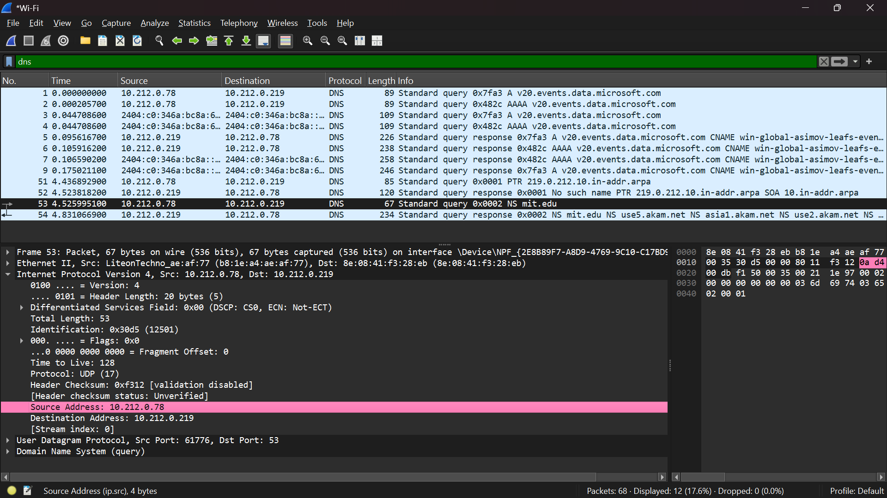
2. Periksa pesan permintaan DNS. Apa ”jenis” atau ”type” dari pesan tersebut? Apakah pesan tersebut mengandung ”jawaban” atau ”answers”?
- Jawaban: pesan permintaan dns dengan type NS dan tidak mengandung answer
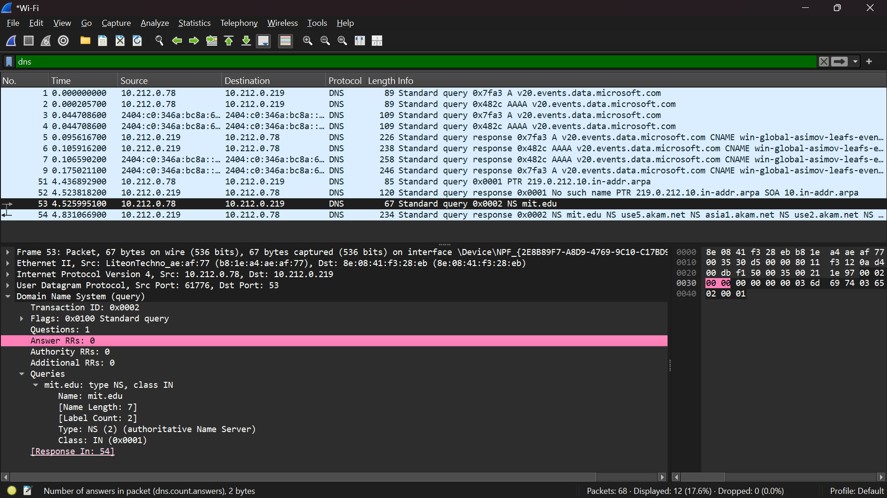
3. Periksa pesan balasan DNS. Apa nama server MIT yang diberikan oleh pesan balasan? Apakah pesan balasan ini juga memberikan alamat IP untuk server MIT tersebut?
- Jawaban: pesan balasan dns tidak memberikan alamat IP untuk server MIT
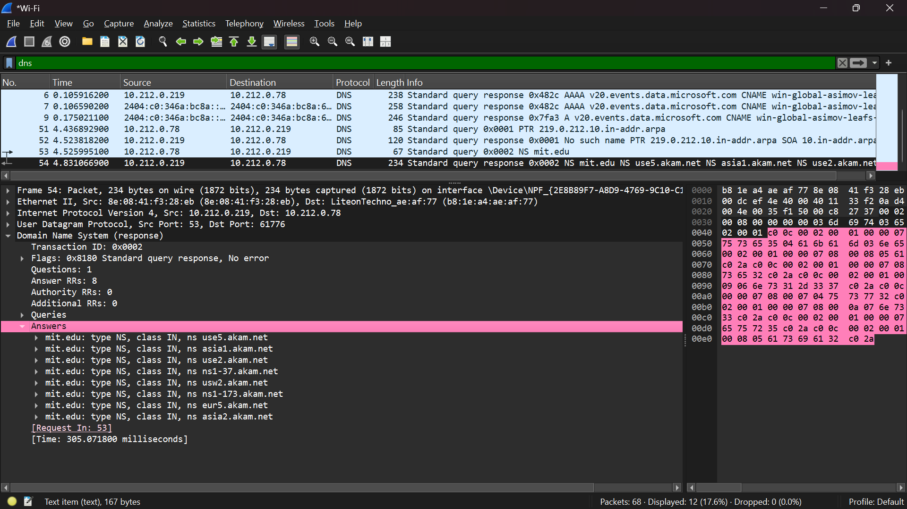

#### Percobaan ke-4
1. Mulai capture paket pada wireshark
2. Lakukan perintah "nslookup www.aiit.or.kr bitsy.mit.edu" pada cmd
3. Stop capturing paket pada wireshark

Pertanyaan:
1. Ke alamat IP manakah pesan permintaan DNS dikirimkan? Apakah alamat IP tersebut merupakan default alamat IP server DNS lokal Anda?
- Jawaban: pesan permintaan di kirimkan pada alamat IP 2404:c0:bc8a:64cf:a546:ba33:3d6b 
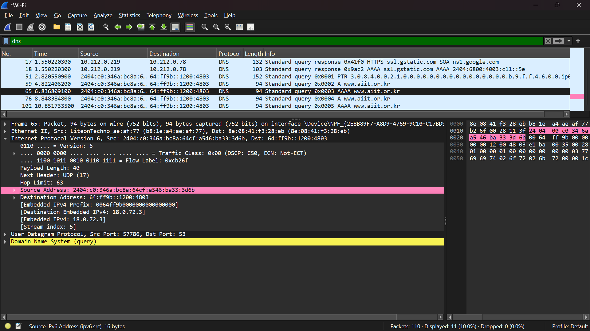
2. Periksa pesan permintaan DNS. Apa ”jenis” atau ”type” dari pesan tersebut? Apakah pesan tersebut mengandung ”jawaban” atau ”answers”?
- Jawaban: type permintaan pesan dns adalah AAAA dan pesan permintaan tersebut tidak mengandung answer
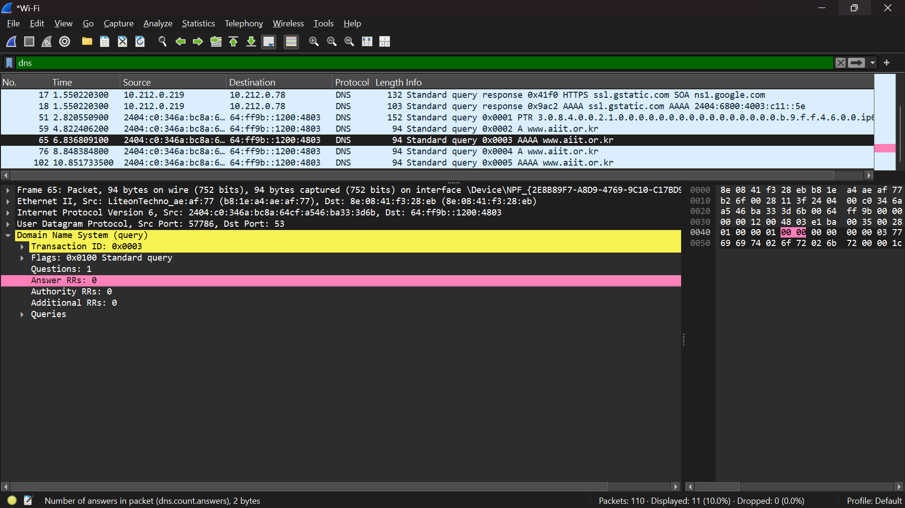
3. Periksa pesan balasan DNS. Berapa banyak ”jawaban” atau “answers” yang terdapat di dalamnya. Apa saja isi yang terkandung dalam setiap jawaban tersebut?
- Jawaban: tidak ada answer