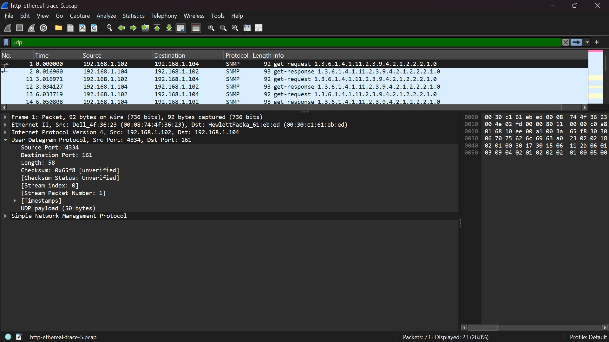
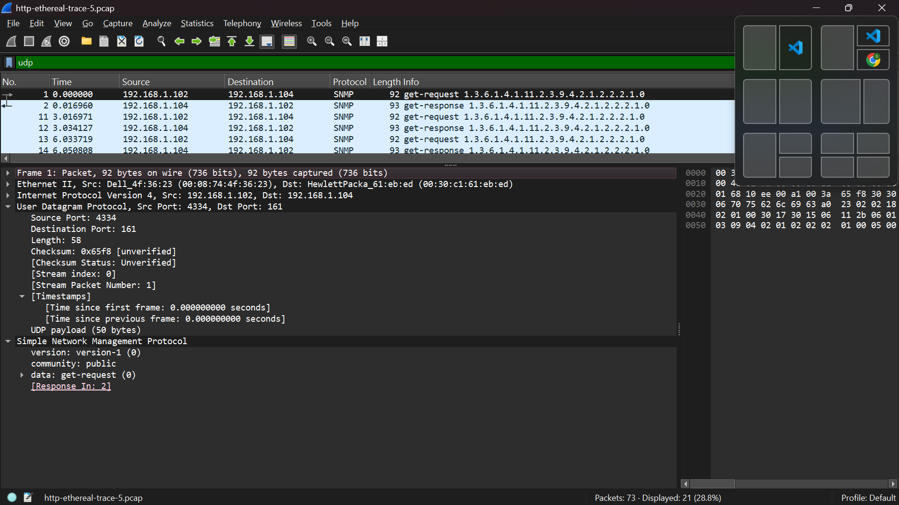
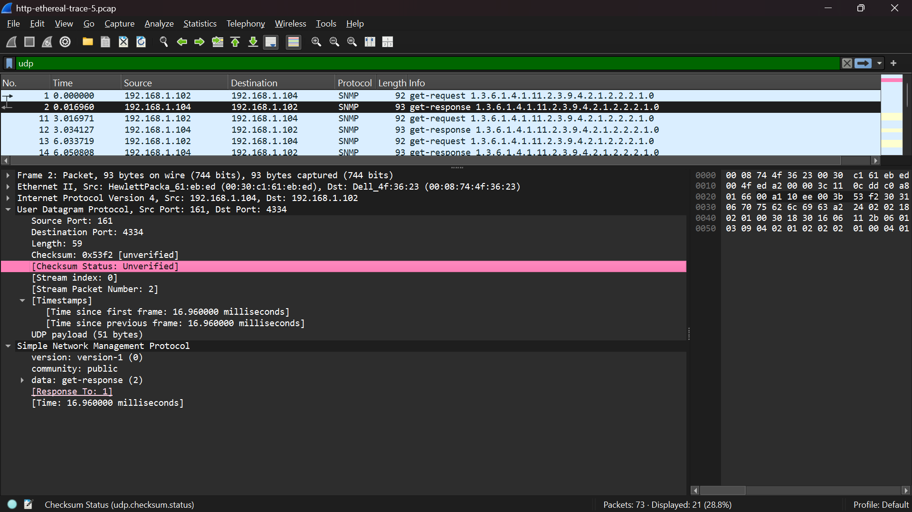
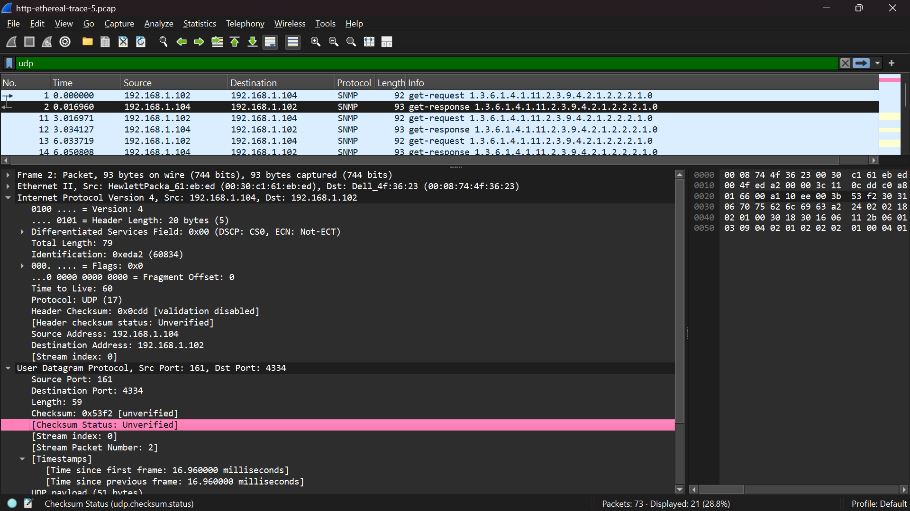

# Laporan Praktikum Jaringan Komputer
Nama    : Chartika Jenyansa Pangaribuan
NIM     : 103072400026

## Langkah Percobaan
1. Unduh zip ini http://gaia.cs.umass.edu/wireshark-labs/wireshark-traces.zip.
2. Cari 'http-ethereal-trace-5', lalu ekstrak file.
3. Tambahkan ".pcap" dibelakang nama file agar bisa dibuka di wireshark.
4. Buka file 'http-ethereal-trace-5' di wireshark.
5. Gunakan filter "udp" untuk menampilkan UDP saja di jendela daftar paket.

### Pertanyaan
1. Pilih satu paket UDP yang terdapat pada trace Anda. Dari paket tersebut, berapa banyak “field” yang terdapat pada header UDP? Sebutkan nama-nama field yang Anda temukan!
- Jawaban: header udp memiliki 4 field, yaitu: Source Port, Destination Port, Length, dan Checksum

2. Perhatikan informasi “content field” pada paket yang Anda pilih di pertanyaan 1. Berapa panjang (dalam satuan byte) masing-masing “field” yang terdapat pada header UDP?
- Jawaban: setiap field pada header udp masing-masing berukuran 2 byte sehingga total panjang header udp adalah 8 byte

3. Nilai yang tertera pada ”Length” menyatakan nilai apa? Verfikasi jawaban Anda melalui paket UDP pada trace.
- Jawaban: Nilai pada field Length menunjukkan total panjang segmen UDP, yaitu gabungan antara header dan payload. Pada paket yang diamati, nilai Length adalah 58 byte, yang terdiri dari 8 byte header dan 50 byte data, sehingga sesuai dengan definisi tersebut.

4. Berapa jumlah maksimum byte yang dapat disertakan dalam payload UDP? (Petunjuk:jawaban untuk pertanyaan ini dapat ditentukan dari jawaban Anda untuk pertanyaan 2)
- Jawaban: Berdasarkan paket yang diamati, panjang UDP payload adalah 50 byte (hasil dari 58 byte total dikurangi 8 byte header). Namun, secara teori ukuran maksimum payload UDP adalah 65527 byte, yang diperoleh dari maksimum nilai field Length (65535 byte) dikurangi panjang header UDP (8 byte).

5. Berapa nomor port terbesar yang dapat menjadi port sumber? (Petunjuk: lihat petunjuk pada pertanyaan 4)
- Jawaban: Nomor port terbesar yang dapat digunakan sebagai port sumber adalah 65535. Hal ini dikarenakan field port pada UDP menggunakan ukuran 16 bit, sehingga rentang nilai port yang tersedia adalah dari 0 sampai 65535. Oleh karena itu, nilai maksimum yang bisa digunakan sebagai port sumber adalah 65535.

6. Berapa nomor protokol untuk UDP? Berikan jawaban Anda dalam notasi heksadesimal dan desimal. Untuk menjawab pertanyaan ini, Anda harus melihat ke bagian ”Protocol” pada datagram IP yang mengandung segmen UDP.
- Jawaban: Pada header IP yang membungkus segmen UDP, field Protocol bernilai 17, yang dalam bentuk heksadesimal dituliskan sebagai 0x11. Nilai ini merupakan kode identifikasi bahwa payload pada datagram IP tersebut menggunakan protokol UDP.

7. Periksa pasangan paket UDP di mana host Anda mengirimkan paket UDP pertama dan paket UDP kedua merupakan balasan dari paket UDP yang pertama. (Petunjuk: agar paket kedua merupakan balasan dari paket pertama, pengirim paket pertama harus menjadi tujuan dari paket kedua). Jelaskan hubungan antara nomor port pada kedua paket tersebut!
- Jawaban: Paket pertama dikirim dari host 192.168.1.102 dengan source port 4334 menuju destination port 161 pada host 192.168.1.104. Paket kedua merupakan balasan dari server, di mana source port menjadi 161 dan destination port menjadi 4334. Hal ini menunjukkan bahwa pada komunikasi UDP, nomor port pada paket balasan merupakan kebalikan dari paket permintaan, sehingga data dapat dikirim kembali ke aplikasi yang tepat pada host pengirim.
