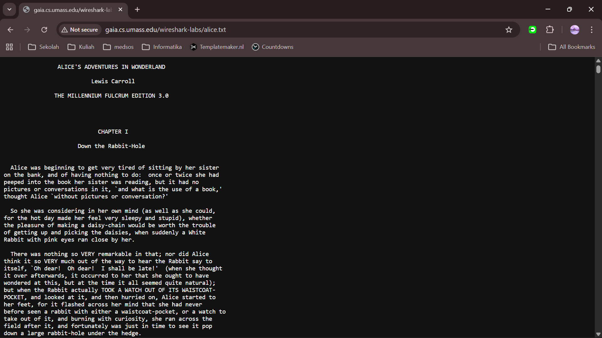
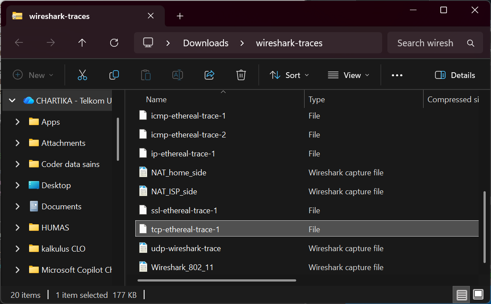

# Laporan Praktikum Jaringan Komputer
Nama    : Chartika Jenyansa Pangaribuan
NIM     : 103072400026

## Tujuan Praktikum
Menginvestigasi cara kerja protokol TCP menggunakan Wireshark

## Langkah Percobaan
### Menangkap Tansfer TCP dalam Jumlah Besar dari Komputer Pribadi ke Remote Server 
1. Buka URL Buka http://gaia.cs.umass.edu/wireshark-labs/alice.txt (pastikan harus http bukan https).

2. Salin seluruh teks ke notepad dan simpan dalam bentuk format txt

3. Setelah itu buka URL http://gaia.cs.umass.edu/wireshark-labs/TCP-wireshark-file1.html

4. Pilih "choose file" dan masukkan file Alice yang sudah disimpan sebelumnya

5. Mulai capture wireshark, tunggu beberapa saat lalu pilih "upload file"

6. Stop capturing packets, maka tampilan wireshark akan seperti ini

### Tampilan Awal pada Captured Trace
1. Download Trace zip pada http://gaia.cs.umass.edu/wireshark-labs/wireshark-traces.zip lalu ekstrak
2. Cari file tcp-ethereal-trace-1 lalu tambahkan pcap dibagian belakangnya (tcp-ethereal-trace-1.pcap) agar bisa dibuka di wireshark

3. Buka file tersebut di wireshark, lalu filter menjadi protokol TCP. maka akan muncul Three-way hanshake seperti ini

Pertanyaan:
1. Berapa alamat IP dan nomor port TCP yang digunakan oleh komputer klien (sumber) untuk mentransfer file ke gaia.cs.umass.edu? Cara paling mudah menjawab pertanyaan ini adalah dengan memilih sebuah pesan HTTP dan meneliti detail paket TCP yang digunakan untuk membawa pesan HTTP tersebut
2. Apa alamat IP dari gaia.cs.umass.edu? Pada nomor port berapa ia mengirim dan menerima segmen TCP untuk koneksi ini?

Jawaban:
1. Alamat IP komputer klien adalah 192.168.1.102 dan nomor port TCP yang digunakan adalah 1161 untuk mentransfer data ke server gaia.cs.umass.edu
2. Alamat IP dari gaia.cs.umass.edu adalah 128.119.245.12. Server menggunakan nomor port 80 untuk mengirim dan menerima segmen TCP dalam koneksi ini

### HTML Documents dengan Embedded Objects
Pertanyaan:
1. Berapa nomor urut segmen TCP SYN yang digunakan untuk memulai sambungan TCP antara komputer klien dan gaia.cs.umass.edu? Apa yang dimiliki segmen tersebut sehingga teridentifikasi sebagai segmen SYN?
2. Berapa nomor urut segmen SYNACK yang dikirim oleh gaia.cs.umass.edu ke komputer klien sebagai balasan dari SYN? Berapa nilai dari field Acknowledgement pada segmen SYNACK? Bagaimana gaia.cs.umass.edu menentukan nilai tersebut? Apa yang dimiliki oleh segmen sehingga teridentifikasi sebagai segmen SYNACK?
3. Berapa nomor urut segmen TCP yang berisi perintah HTTP POST? Perhatikan bahwa untuk menemukan perintah POST, Anda harus menelusuri content field milik paket di bagian bawah jendela Wireshark, kemudian cari segmen yang berisi "POST" di bagian field DATAnya.
4. Anggap segmen TCP yang berisi HTTP POST sebagai segmen pertama dalam koneksi TCP. Berapa nomor urut dari enam segmen pertama dalam TCP (termasuk segmen yang berisi HTTP POST)? Pada jam berapa setiap segmen dikirim? Kapan ACK untuk setiap segmen diterima? Dengan adanya perbedaan antara kapan setiap segmen TCP dikirim dan kapan acknowledgement-nya diterima, berapakah nilai RTT untuk keenam segmen tersebut?Berapa nilai EstimatedRTT setelah penerimaan setiap ACK? (Catatan: Wireshark memiliki fitur yang memungkinkan Anda untuk memplot RTT untuk setiap segmen TCP yang dikirim. Pilih segmen TCP yang dikirim dari klien ke server gaia.cs.umass.edu pada jendela "daftar JARINGAN KOMPUTER 36 paket yang ditangkap". Kemudian pilih: Statistics->TCP Stream Graph- >Round Trip Time Graph).
5. Berapa panjang setiap enam segmen TCP pertama?
6. Berapa jumlah minimum ruang buffer tersedia yang disarankan kepada penerima dan diterima untuk seluruh trace? Apakah kurangnya ruang buffer penerima pernah menghambat pengiriman?
7. Apakah ada segmen yang ditransmisikan ulang dalam file trace? Apa yang anda periksa (di dalam file trace) untuk menjawab pertanyaan ini?

Jawaban:
1. Sesuai dengan yang didapatkan segmen TCP pertama memiliki relative sequence number 0. Segmen ini diidentifikasi sebagai segmen SYN karena bagian TCP Flag terdapat tanda 'Syn: Set' dengan nilai Flag 0x002.
Segmen ini dapat diidentifikasi sebagai segmen SYN karena memiliki flag SYN yang aktif, yang berfungsi untuk memulai koneksi TCP dalam proses three-way handshake.

2. Pada segmen SYN-ACK (paket ke-2) nilai relative sequence number yang digunakan server adalah 0, sedangkan nilai Acknowledgment number adalah 1. Nilai acknowledgment ini diperoleh dari nilai sequence number klien sebelumnya (0) ditambah 1, sehingga pada gambar nilai Next Sequence Number adalah 1. 
Segmen ini diidentifikasi sebagai SYN-ACK karena memiliki kedua flag SYN dan ACK yang aktif, yang menunjukkan bahwa segmen tersebut merupakan balasan dari permintaan koneksi sekaligus konfirmasi penerimaan SYN dari klien.

3. Berdasarkan analisis trace pada paket nomor 199, segmen TCP yang membawa perintah HTTP POST memiliki relative sequence number sebesar 164041. Segmen ini merupakan bagian awal dari pengiriman data dari klien ke server setelah koneksi TCP terbentuk, sehingga sequence number tersebut digunakan sebagai acuan dalam proses transfer data TCP.

4. 