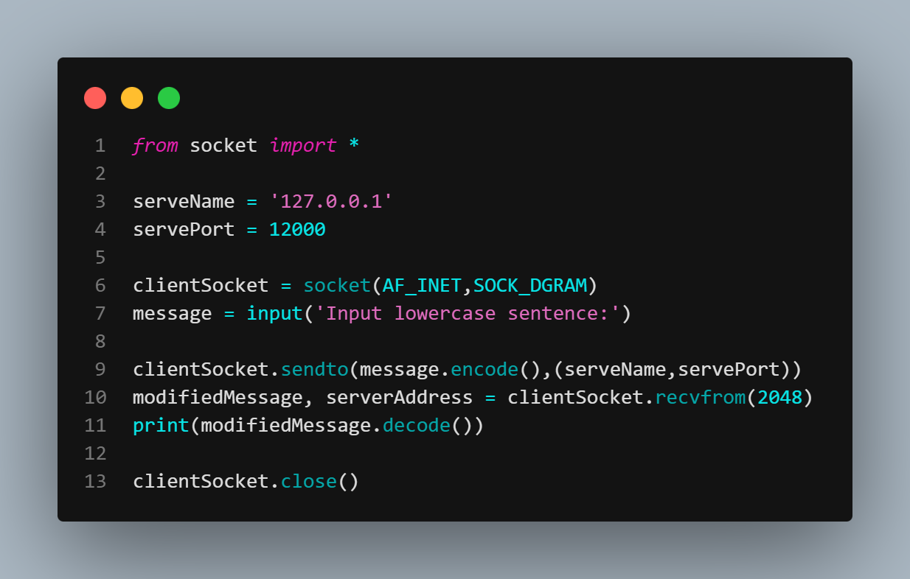
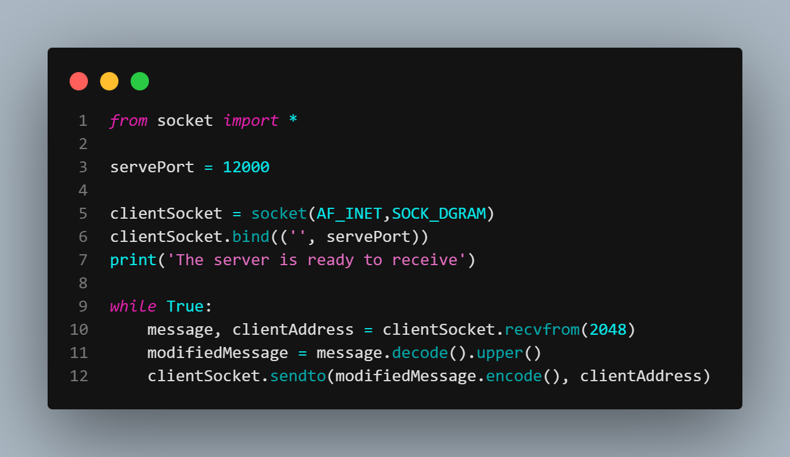
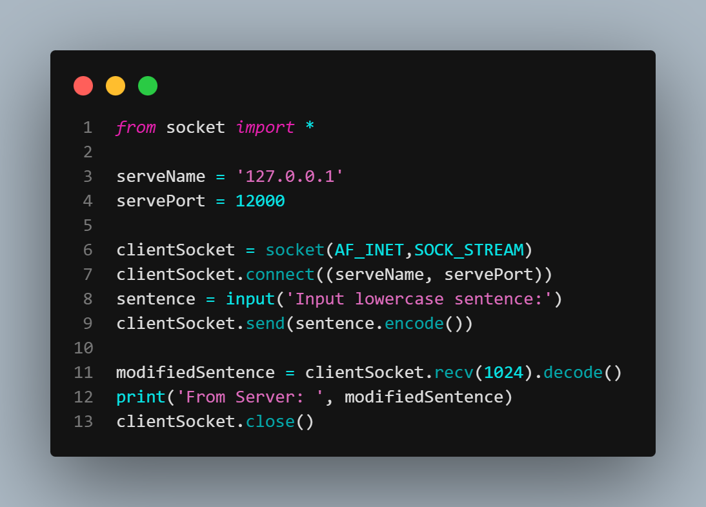
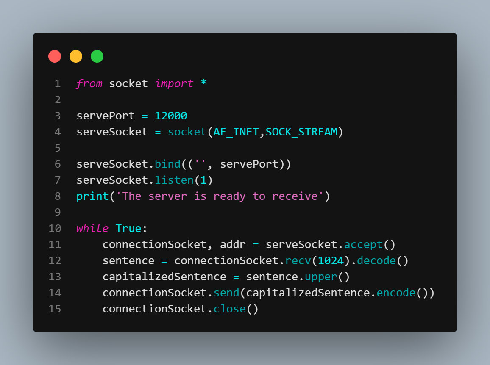

# Laporan Praktikum Jaringan Komputer
Nama    : Chartika Jenyansa Pangaribuan
NIM     : 103072400026

## UDPClient.py
1. membuka socket UDP
2. Membaca baris input dari pengguna
3. Melampirkan alamat server (IP dan Port) ke pesan
4. Mengirimkan pesan melalui socket ke server
5. Menunggu dan menerima pesan balasan dari server
6. Menutup socket

## UDPServer.py
1. Membuka socket UDP
2. Bind nomor port ke socket tersebut
3. Masuk ke while loop untuk menunggu paket dari client
4. Menerima pesan dan alamat client
5. Memproses pesan (misal mengubah huruh ke kapital)
6. Mengirimkan pesan yang sudah diproses kembali ke alamat client

### Output UDP

## TCPClient.py
1. Membuat socket sama seperti server , client membuat socket TCP
2. Connect: Client harus melakukan Connect() ke alamat IP dan nomor port server yang dituju. Di balik proses layar ini proses 3 way handshake TCP
3. Kirim Data: Koneksi sudah terbentuk, client cukup menggunakan fungsi send() untuk mengirimkan pesan tanpa perlu melampirkan alamat tujuan di setiap paket ( berbeda dengan UDP)
4. Terima balasan : Client menunggu dan membaca data dari server menggunakan recv()
5. Close: Menutup socket setelah pertukaran data selesai

## TCPServer
1. Membuat Socket: Server membuat soket TCP menggunakan AF_INET (untuk IPv4) dan SOCK_STREAM (untuk TCP)
2. Bind: Mengaitkan nomor port tertentu ke soket server agar klien tahu ke mana harus menghubungi
3. Listen: Server mulai mendengarkan (listening) permintaan koneksi masuk
4. Accept: Ketika klien mencoba terhubung, server menjalankan fungsi accept(). Ini akan menghasilkan soket baru (connectionSocket) khusus digunakan berkomunikasi dengan klien tersebut, sementara soket utama tetap mendengarkan koneksi baru lainnya
5. Komunikasi: Menerima data menggunakan recv() dan mengirim balasan menggunakan send()
6. Close: Menutup koneksi setelah selesai

### Output TCP 
